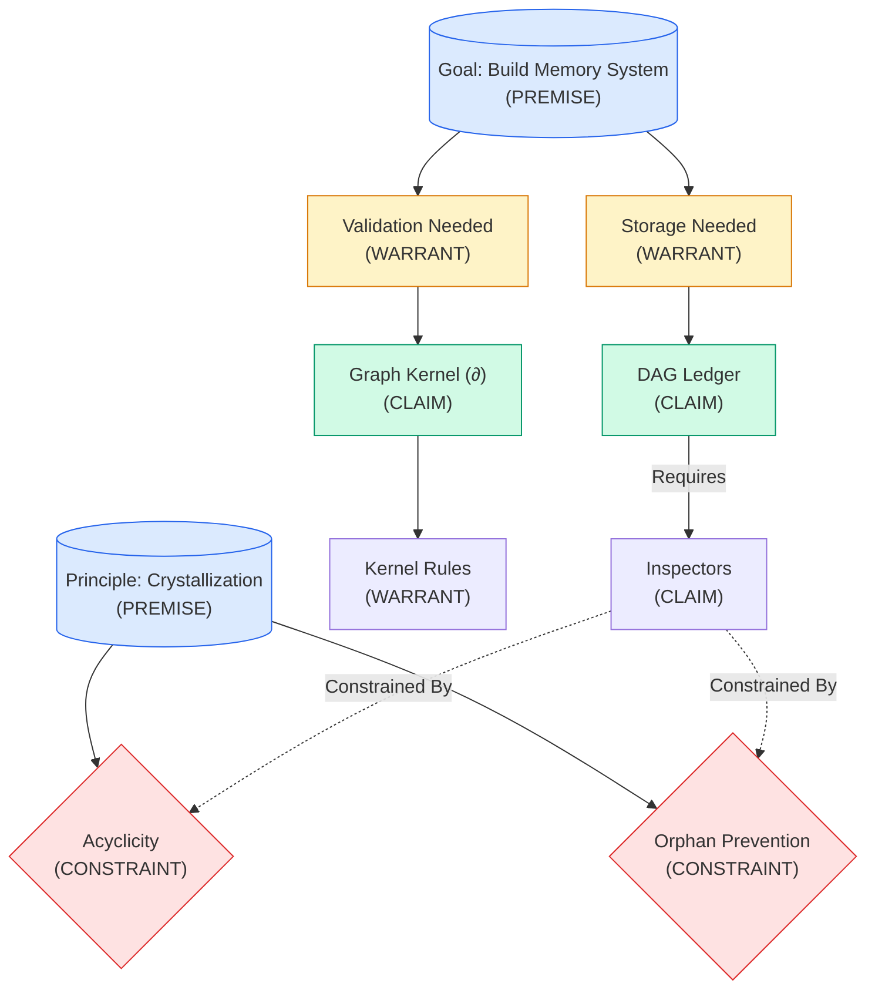

# Memory System Graph Walkthrough

I have successfully constructed a reasoning graph representing the **VGCP Memory System** architecture. This graph demonstrates the core principles, components, and constraints of the memory system using the Verifiable Graph Context Protocol.

## Graph Summary

- **Total Nodes**: 10
- **Total Edges**: 10
- **Root Nodes**: 2 (`n1`, `n2`)
- **Status**: Valid DAG (acyclic, grounded)

## Graph Visualization



## Detailed Graph State

The current state of the reasoning graph in JSON format:

```json
{
  "nodes": [
    { "id": "n1", "type": "PREMISE", "content": "Goal: Build a Verifiable Graph Memory System" },
    { "id": "n2", "type": "PREMISE", "content": "Principle: Crystallization..." },
    { "id": "n3", "type": "WARRANT", "content": "Thoughts must be validated before commitment..." },
    { "id": "n4", "type": "WARRANT", "content": "Valid thoughts need a structured storage medium." },
    { "id": "n5", "type": "CLAIM", "content": "Implement a Graph Kernel (∂)..." },
    { "id": "n6", "type": "CLAIM", "content": "Use a Directed Acyclic Graph (DAG) as the Ledger." },
    { "id": "n7", "type": "WARRANT", "content": "The Kernel needs specific rules to enforce validity." },
    { "id": "n8", "type": "CLAIM", "content": "Implement Inspectors: Orphan Prevention, Tool Causality..." },
    { "id": "n9", "type": "CONSTRAINT", "content": "Constraint: Acyclicity..." },
    { "id": "n10", "type": "CONSTRAINT", "content": "Constraint: Orphan Prevention..." }
  ]
}
```

## Verification

The graph was verified using the `mcp_vgcp_get_graph_state` tool. All nodes were successfully created and linked according to the [implementation_plan.md](file:///home/ty/.gemini/antigravity/brain/bb18b8e7-fe07-4e4e-bc0d-3fb3d6469173/implementation_plan.md). The graph represents a coherent reasoning chain from the goal (n1) and principle (n2) down to the specific implementation details (n5, n6) and validation rules (n9, n10).
